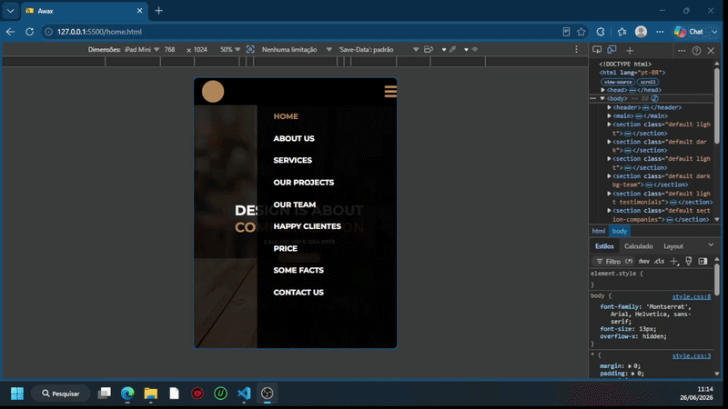
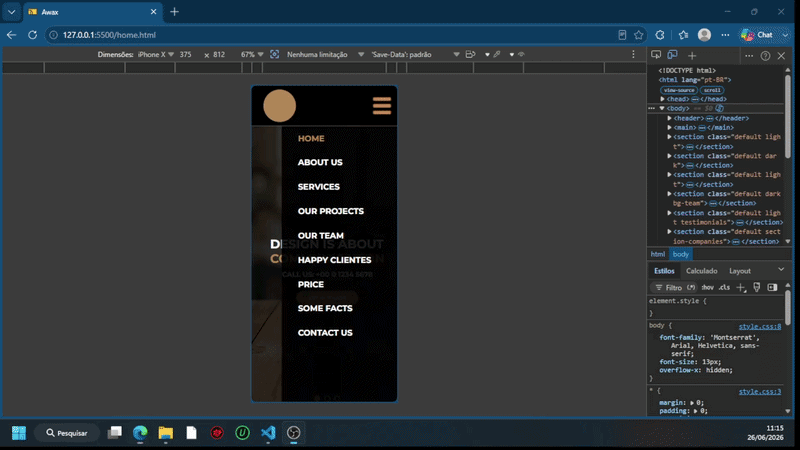

# ✅ Awax

> Reprodução fiel de um layout profissional do Behance, construída com HTML5, CSS3 e JavaScript puro — foco em responsividade e domínio do CSS Flexbox.

O **Awax** é uma landing page completa de agência criativa, desenvolvida como exercício prático durante o curso **"HTML e CSS Avançado"** na plataforma [B7Web](https://b7web.com.br), ministrado pelo professor Bonieky. O layout original foi criado por [Alexander Bukin](https://www.behance.net) no Behance e serviu como referência para a reprodução fiel da interface — da estrutura semântica ao comportamento responsivo em dispositivos móveis.

---

## 🎥 Demonstração

### Visão Geral da Página


---

### 📱 Responsividade — Tablet



---

### 📱 Responsividade — Celular



---

## 🎯 Objetivo

Praticar na prática a construção de uma página web completa a partir de um layout real do Behance, aplicando:

- Estruturação semântica com HTML5
- Estilização avançada com CSS3 e CSS Flexbox
- Responsividade para múltiplos dispositivos com Media Queries
- Manipulação básica do DOM com JavaScript puro (menu mobile interativo)

---

## ⚙️ Funcionalidades

- Banner com slider de slides navegáveis por indicadores (dots)
- Menu de navegação com toggle mobile — abre e fecha ao clique, com fundo escurecido
- Seção "About Us" com texto descritivo e imagem lateral
- Seção "Services" com cards de serviços em grid flexível
- Galeria de projetos com filtros por categoria e exibição de fotos em hover
- Seção "Our Team" com cards de membros e redes sociais
- Seção "Happy Clients" com depoimentos e avaliação por estrelas
- Tabela de preços com destaque para plano premium
- Contador de fatos ("Some Facts") com números de destaque
- Seção de logotipos de empresas parceiras
- Formulário de contato com campos de nome, e-mail e mensagem
- Mapa de localização embutido
- Rodapé com links de redes sociais (Facebook, Twitter, LinkedIn, Google+, Pinterest)
- Layout totalmente responsivo para tablet (até 800px) e celular (até 450px)

---

## 🛠️ Tecnologias Utilizadas

- **HTML5** — Estrutura semântica da página
- **CSS3** — Estilização completa, incluindo variáveis de layout, sombras, transições e pseudo-elementos
- **CSS Flexbox** — Sistema de layout principal, usado em todas as seções
- **JavaScript (ES6+)** — Lógica do menu mobile (toggle de exibição e troca de cor de fundo)
- **Google Fonts** — Fontes Montserrat e Noto Sans JP via CDN

---

## 🧠 Conceitos Aplicados

- CSS Flexbox (`display: flex`, `flex-direction`, `justify-content`, `align-items`, `flex-wrap`, `flex: 1`)
- Responsividade com Media Queries (`max-width: 450px` e intervalo `450px–800px`)
- Reset CSS com `box-sizing: border-box` e zeragem de margens/paddings
- Manipulação do DOM via `querySelector` e `addEventListener`
- Uso de `overflow-x: hidden` para controle de scroll horizontal em mobile
- Organização de assets com separação entre imagens de interface (`assets/images/`) e mídia de conteúdo (`media/`)
- Google Fonts via `<link>` com `preconnect` para performance

---

## 📂 Estrutura do Projeto

```plaintext
Awax/
├── home.html                  # Página principal (arquivo único)
├── assets/
│   ├── css/
│   │   └── style.css          # Toda a estilização da página
│   └── images/                # Ícones e imagens de interface
│       ├── menu.png
│       ├── estrela.png
│       ├── arroba.png
│       ├── carta.png
│       ├── telefone.png
│       ├── localizacao.png
│       └── ... (demais ícones)
├── media/                     # Fotos de conteúdo e logos de empresas
│   ├── foto1.jpg ... foto9.jpg
│   ├── empresa1.png ... empresa6.png
│   ├── homem1.png, homem2.png
│   ├── mulher1.png, mulher2.png
│   └── livros.png
└── docs/
    └── images/
        ├── demostracao.gif
        ├── responsividade-tablet.gif
        └── responsividade-celular.gif
```

---

### 📌 Principais Arquivos

| Arquivo | Responsabilidade |
|---|---|
| `home.html` | Estrutura completa da landing page com todas as 13 seções e lógica JavaScript do menu mobile |
| `assets/css/style.css` | Toda a estilização: layout Flexbox, tipografia, cores, responsividade e estados interativos |
| `assets/images/` | Ícones e imagens de interface (redes sociais, símbolos de contato, elementos decorativos) |
| `media/` | Imagens de conteúdo usadas nas seções de portfólio, equipe e depoimentos |
| `docs/images/` | GIFs de demonstração para documentação no GitHub |

---

## 🚀 Como Executar

Por ser um projeto em HTML/CSS/JS puro, não há dependências ou build necessários.

### 1️⃣ Clone o repositório

```bash
git clone https://github.com/yuriRLombardi/awax.git
```

### 2️⃣ Abra no navegador

Navegue até a pasta do projeto e abra o arquivo diretamente no navegador:

```bash
cd awax
```

Depois abra o arquivo `home.html` no navegador de sua preferência — ou use a extensão **Live Server** no VS Code para recarregamento automático.

---

## 📈 Melhorias Futuras

- Implementar o slider do banner com transição automática via JavaScript
- Adicionar funcionalidade real ao formulário de contato (envio de e-mail)
- Implementar filtro de projetos na galeria com animação de transição
- Converter o CSS para SASS/SCSS para melhor organização e reuso
- Adicionar animações de entrada nas seções ao rolar a página (scroll animations)

---

## 👨‍💻 Autor

Yuri Rodrigues Lombardi

🔗 LinkedIn: [linkedin.com/in/yuri-rodrigues-lombardi](https://linkedin.com/in/yuri-rodrigues-lombardi)

💻 GitHub: [github.com/yuriRLombardi](https://github.com/yuriRLombardi)

---

> Layout original criado por [Alexander Bukin](https://www.behance.net) no Behance. Reprodução desenvolvida para fins de aprendizado no curso "HTML e CSS Avançado" — [B7Web](https://b7web.com.br), professor Bonieky.